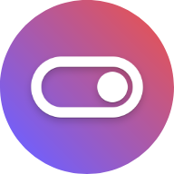

# FFS

Feature flags solution that is fast ⚡, lean 🤏, and open-source 🌍.

## Project

FFS is built primarily on Kotlin Multiplatform and made up of 4 major components:
- A [dashboard](ffs-dashboard), to create and manage feature flags.
- Client libraries to consume feature flags:
  - For the [frontend](ffs-library-frontend) or unsafe environments, relying on the server for evaluation results.
  - For the [backend](ffs-library-backend) or safe environments, evaluating feature flags locally.
- A [server](ffs-server) that provides APIs for the dashboard and libraries.

See each README for project-specific information.

## Why

Because no other solutions nail this specific intersection of values.

⚡ Instant updates using [server-sent events](https://developer.mozilla.org/en-US/docs/Web/API/Server-sent_events). Changes are propagated instantly to clients.  
⚡ Evaluates over 40,000 [overly complex rules](ffs-server/src/benchmark/kotlin/rule/RuleEvalBenchmark.kt) per second. On a Raspberry Pi 4 Model B. Per core.  
⚡ 🔜 Dedicated frontend library for JavaScript, going for no-compromises where bundle size matters.

🤏 Limited in feature set and code surface. It does few things, and it does them right.  
🤏 No bloat. Complimentary functions should be handled by complimentary tools.  
🤏 Easy to grasp, maintain, and improve across all libraries and server.

🌍 Open-source first and foremost. No special versions or closed add-ons for enterprise.  
🌎  🔜 Easy to set up and deploy. We can run it for you, but out of convenience, not complexity.  
🌏 Welcoming to all contributions that abide by these values. We'll help along the way, too.

## License

Released under the [MIT License](https://opensource.org/licenses/MIT).
